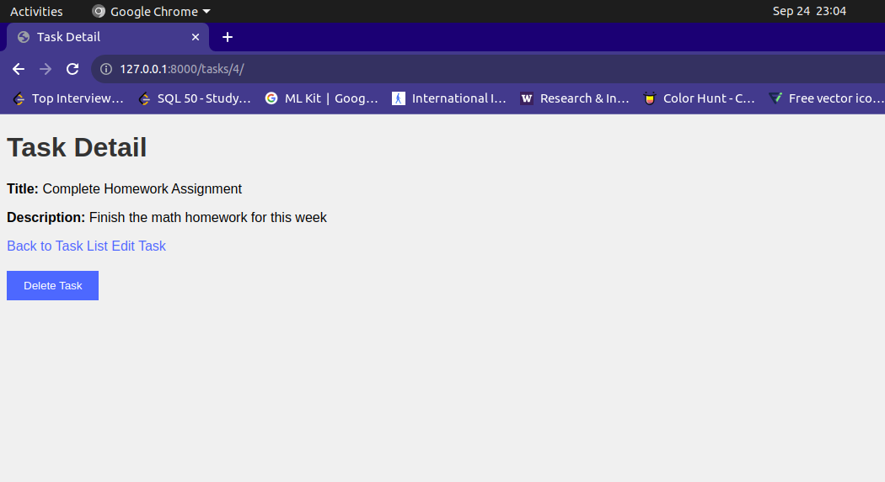

# task_project

python internship assignment

[](https://github.com/cookiecutter/cookiecutter-django/)
[](https://github.com/ambv/black)

License: MIT


## Installation:

1. Clone the repository to your local machine:

   ```shell
   git clone https://github.com/your-username/your-project.git
    ```
2. Create a virtual environment with `virtualenv` and install dependencies:
```shell 
mkvirtualenv your-project-env
workon your-project-env  # Activate the virtual environment
pip install -r requirements/local.txt
```

3. Install project dependencies:
```shell
pip install -r requirements/local.txt # For development
pip install -r requirements/production.txt # For production
```

4. Run database migrations:
```shell
python manage.py makemigrations
python manage.py migrate
```
5. Create a superuser account:
```shell
python manage.py createsuperuser
```

6. Run the development server:
```shell
python manage.py runserver
```

7. I have added the screenshots to view the application.

### Adding Screenshots


## Screenshots

### Task List


### Task Detail


### Create Task


### Edit Task


### Delete Task (Confirmation)



## Basic Commands

### Setting Up Your Users

- To create a **normal user account**, just go to Sign Up and fill out the form. Once you submit it, you'll see a "Verify Your E-mail Address" page. Go to your console to see a simulated email verification message. Copy the link into your browser. Now the user's email should be verified and ready to go.

- To create a **superuser account**, use this command:

      $ python manage.py createsuperuser

For convenience, you can keep your normal user logged in on Chrome and your superuser logged in on Firefox (or similar), so that you can see how the site behaves for both kinds of users.

### Type checks

Running type checks with mypy:

    $ mypy task_project

### Test coverage

To run the tests, check your test coverage, and generate an HTML coverage report:

    $ coverage run -m pytest
    $ coverage html
    $ open htmlcov/index.html

#### Running tests with pytest

    $ pytest

### Live reloading and Sass CSS compilation

Moved to [Live reloading and SASS compilation](https://cookiecutter-django.readthedocs.io/en/latest/developing-locally.html#sass-compilation-live-reloading).

## Deployment

The following details how to deploy this application.
